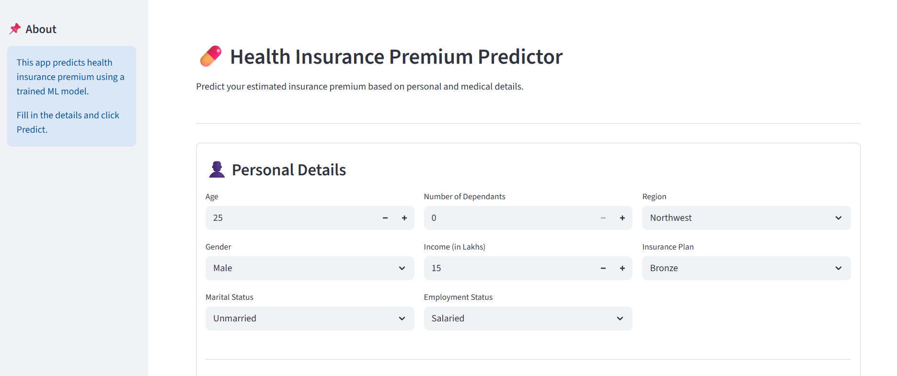
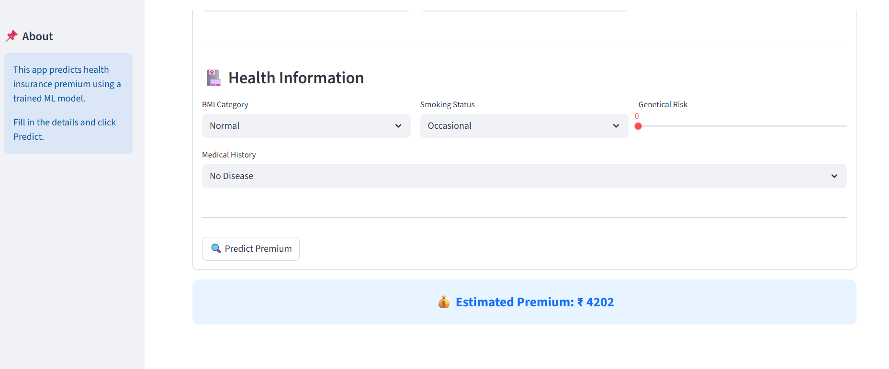

# 🏥 Health Insurance Premium Prediction


---

## 📌 Project Overview

This project builds a Machine Learning system to estimate health insurance premiums based on age, BMI, smoking habits, medical history, and insurance plan type.

Dataset size: **50,000 records**

---

## 🚀 Key Highlights

✔ Large dataset (50K records)  
✔ Outlier detection using box plots  
✔ Feature engineering & encoding  
✔ Multicollinearity handled using VIF  
✔ Error-analysis driven improvements  
✔ Age-based model segmentation  
✔ Hybrid modeling (Linear Regression + XGBoost)  
✔ End-to-end deployment with Streamlit  

---

## 🧠 Modeling Strategy

After error analysis, customers were segmented based on age:

- **Linear Regression** → General age group  
- **XGB Regressor** → Young age group  

This segmentation improved predictive performance.

---

## 🔄 Workflow

1. Data Cleaning  
2. Outlier Treatment  
3. EDA  
4. Feature Engineering  
5. Encoding  
6. VIF Check  
7. Model Training  
8. Error Analysis  
9. Model Segmentation  
10. Deployment  

---

## 🛠 Tech Stack

Frontend: Streamlit  
Backend: Python, Pandas, NumPy  
ML Libraries: Scikit-learn, XGBoost  
Deployment: Streamlit Cloud  

---

## 🌐 Live Demo

🔗 https://aditi-health-insurance-premium-prediction.streamlit.app/

---

## 💻 Run Locally

```bash
git clone https://github.com/AditiPatil31/HealthCare-Premium-Prediction-Project.git
cd HealthCare-Premium-Prediction-Project
pip install -r requirements.txt
streamlit run app.py

---

---

## 📸 Application Screenshots

<p align="center">
  
  
</p>

---
---

## 👩‍💻 Author

<p align="center">
  <b>Aditi Patil</b><br><br>
  
  <a href="https://github.com/AditiPatil31">
    
  </a>
  
  <a href="https://www.linkedin.com/in/aditi-patil31/">
    
  </a>
</p>

---

⭐ If you like this project, consider giving it a star!


⭐ If you like this project, consider giving it a star!

